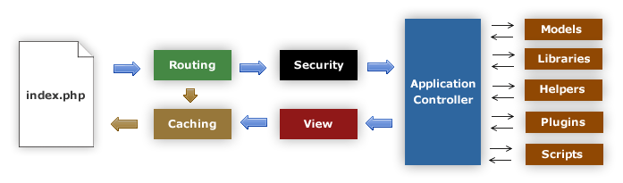

######################
應用程式流程圖
######################

下圖說明了整個系統的資料流程：

|CodeIgniter 程序流程|

#. index.php 文件作為前端控制器，初始化執行 CodeIgniter 所需的基本資源；
#. Router 檢查 HTTP 請求，以確定如何處理該請求；
#. 如果存在快取文件，將直接輸出到瀏覽器，不用走下面正常的系統流程；
#. 在載入應用程式控制器之前，對 HTTP 請求以及任何用戶送出的資料進行安全檢查；
#. 控制器載入模型、核心類庫、輔助函數以及其他所有處理請求所需的資源；
#. 最後一步，渲染檢視並發送至瀏覽器，如果開啟了快取，檢視被會先快取起來用於
   後續的請求。

